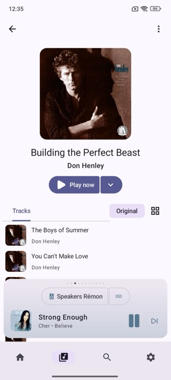
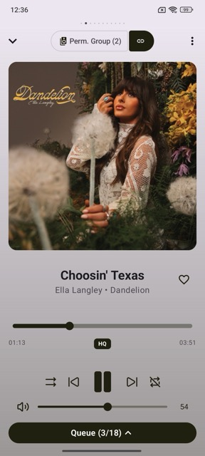
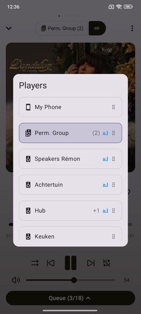
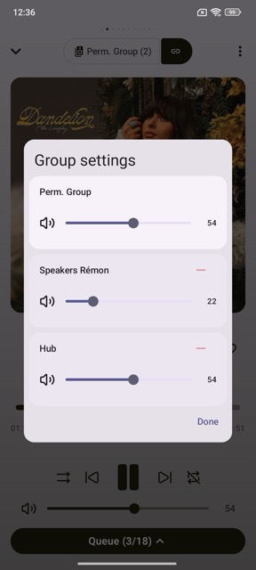
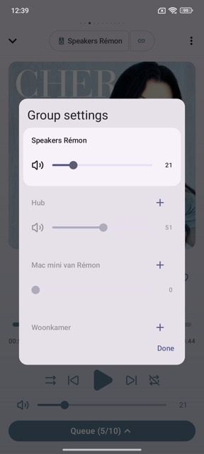
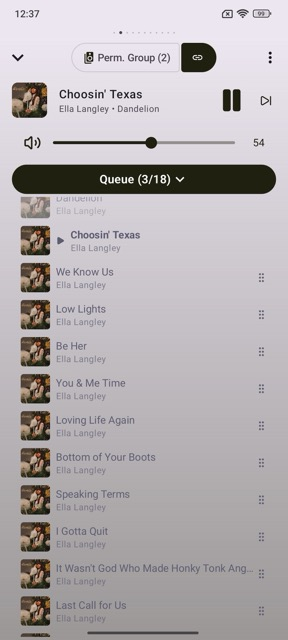
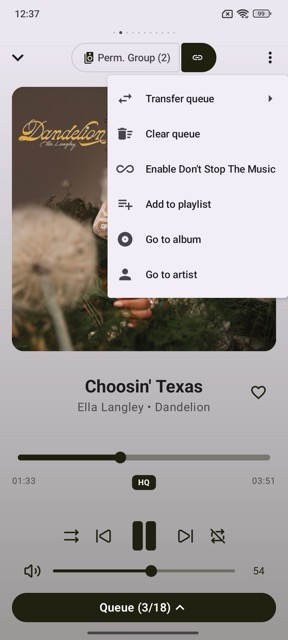

# Players Pager

The Players Pager is always visible and operates independently of the rest of the app. It always reflects the player or group you are currently controlling, regardless of where you navigate.

## Views

The pager has two states you can move between at any time.

### Compacted View
A slim bar anchored at the bottom of the screen. Shows the active player name, grouping controls, and essential playback controls. You can swipe left or right to switch between players without leaving the current screen.

### Expanded View
The full-screen now-playing experience. Shows album art, media info, transport controls, and volume control for external players and groups. Swipe left or right to switch players here too.

> Tap the compacted player bar to open the expanded view. Swipe down on the album art to return to the compacted view.

## Players List

Tap the **player name** in either view to open the Players list.

From the Players list you can:

- **Switch** to any player or player group by tapping it — the active player is always highlighted.
- **Reorder** players and groups by grabbing the **⠿ six-dot handle** on the right of a row and dragging it up or down. The order here is also the order you swipe through.

## Permanent Groups

Permanent groups are pre-configured Music Assistant Group Players. They cannot be created from within the app, but their settings can be managed.

- Tap the **link icon** next to a permanent group to open **Group Settings**.
- Adjust the **master volume** for the group as a whole, or control the **volume of each member** individually.

## Dynamic Grouping

You can create a temporary group on the fly directly from the compacted or expanded player view.

- Tap the **link icon** next to the player name to open Group Settings.
- Tap **+** next to a player to add it to the group.
- Tap **−** next to a player to remove it from the group.
- Tap **−** next to the group leader to remove the leader. The server then moves the queue to a different member. Playback continues from the same position. If no other member stays, the group dissolves and playback stops. The button shows only if the server is new enough.
- Volume controls work the same as permanent groups — adjust the master or per-member volume from the same sheet.

## Gestures

### Compacted view

| Gesture | Action |
|---|---|
| Swipe left / right | Switch to the previous / next player or group |
| Tap | Open the expanded player view |

### Expanded view

| Gesture | Action |
|---|---|
| Swipe left / right | Switch to the previous / next player or group |
| Swipe up from track title | Open the queue |
| Swipe down on album art | Dismiss expanded view → return to compacted view |

### Queue

| Gesture | Action |
|---|---|
| Tap the Queue bar | Open the queue |
| Swipe down on the queue | Dismiss the queue |

## Volume Control

Software volume is available for external players and groups in the expanded view.

- **Drag** the volume bar to adjust continuously.
- **Tap left or right** of the slider position to step the volume up or down in small increments.

> **Good to know:** hardware volume control is only available for the Local Player. It’s not and won’t be available for external players or groups.

## Queue

The queue bar shows your position in the current queue, for example `Queue (3/18)`.

- Swipe up from the title area or tap the queue bar to expand it.
- Tap any track in the queue to jump to it immediately.
- Swipe down on the queue to close it.

### Audiobooks

For audiobooks, the progress bar shows both time progress and chapter markers. The queue displays the **chapter list** instead of individual tracks, letting you jump directly to any chapter.

## Three-Dot Menu (⋮)

The ⋮ menu in the expanded view adapts its options to the type of content currently playing.

Two options are always available regardless of content type:

| Option | Description |
|---|---|
| **Transfer queue** | Move the current queue to another player or group |
| **Clear queue** | Clear the queue and stop playback |

Additional options such as *Add to playlist*, *Go to album*, *Go to artist*, and *Enable Don't Stop The Music* appear depending on whether you are playing a track, album, podcast, or audiobook.

## Favoriting

Tap the **♡ heart icon** next to the track title to add the current content to your favorites. Tap it again to remove it.

## Playback Controls

Transport controls are present in both views. The compacted view shows a stripped-down set to keep the bar uncluttered — the most important controls (play/pause and skip next) are always visible.

The expanded view includes the full control row:

| Control | Description |
|---|---|
| **⏮ Previous** | Go to the previous track |
| **⏭ Next** | Skip to the next track |
| **⏸ Play / Pause** | Toggle playback |
| **⇄ Shuffle** | Toggle shuffle mode |
| **↺ Repeat** | Toggle repeat mode |